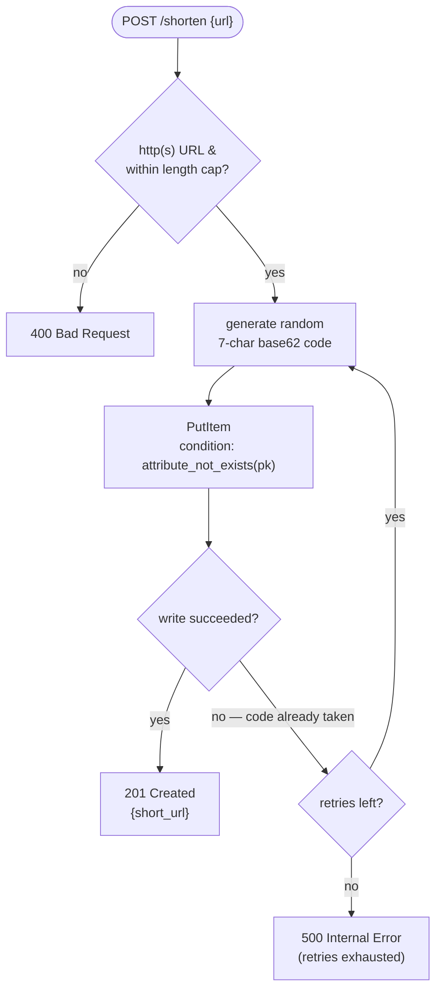
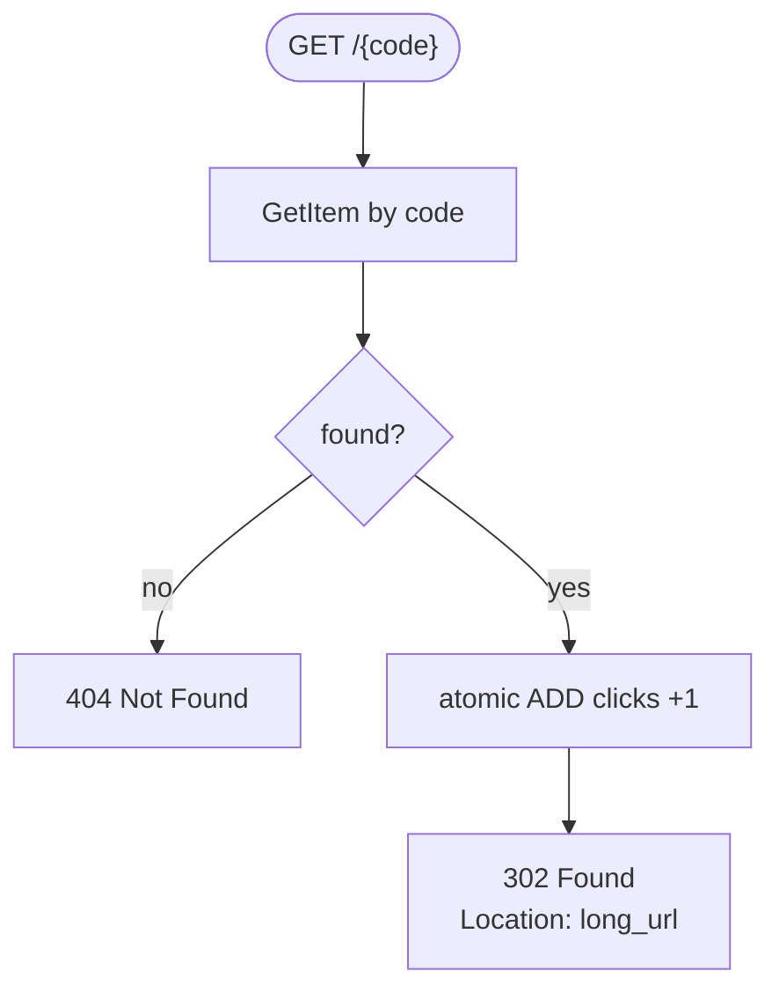
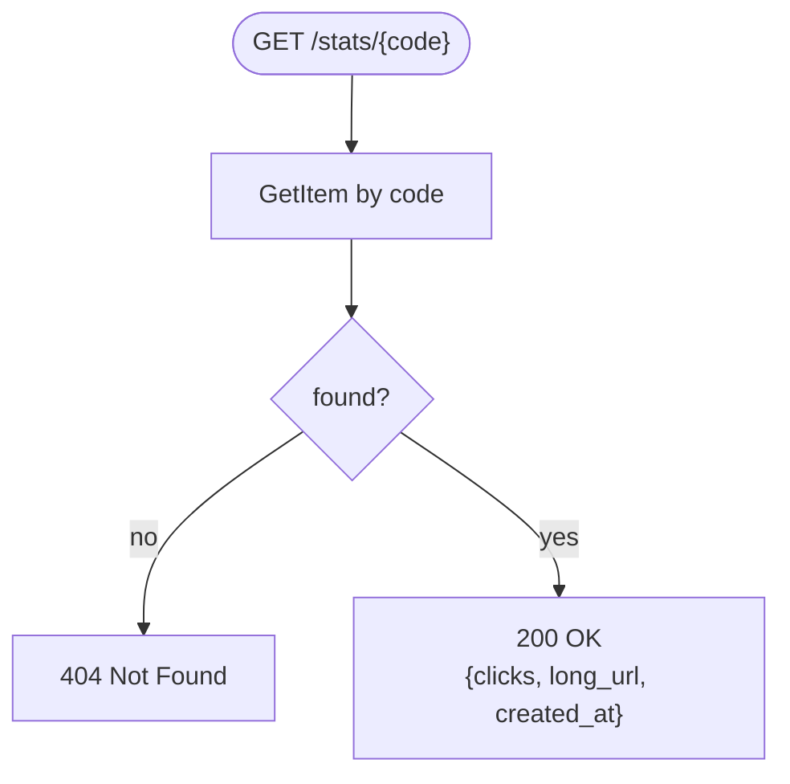

# Request flows (activity diagrams)

The two core activities and the read-only stats path. These describe the
*designed* behavior — every branch traces back to a decision in [`adr/`](adr/):
random code + conditional-write retry (ADR-0001), 302 redirect (ADR-0002),
http(s)-only validation (ADR-0004). GitHub renders the Mermaid below inline.

## Shorten — `POST /shorten {url}`

The interesting part is the **collision-retry loop**: DynamoDB is the uniqueness
referee (a conditional `PutItem`), and on the rare clash we regenerate rather than
coordinate. Retries are bounded so a pathological case fails loudly, not forever.

## Redirect — `GET /{code}`

302 (not 301) so every hit reaches us: we count the click *and* keep the mapping
changeable. "A click" = every visit (ADR-0002).

## Stats — `GET /stats/{code}`

